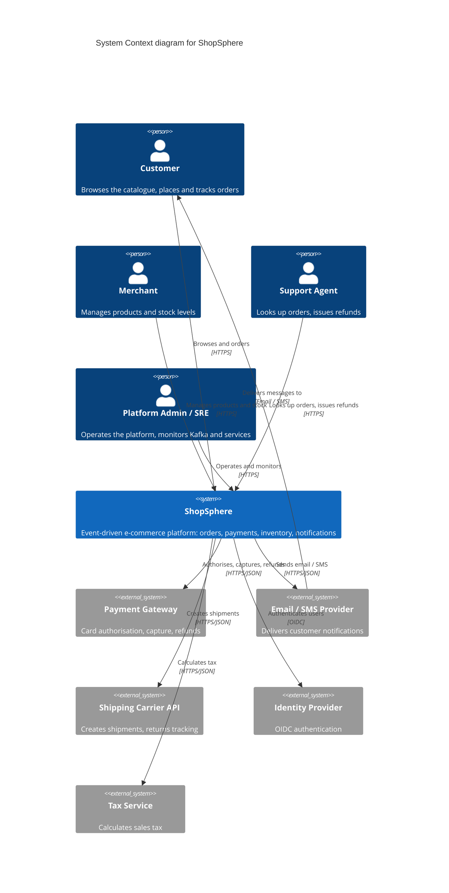

# Level 1: System Context

ShopSphere in its environment: who uses it and which external systems it depends on.

```mermaid
C4Context
    title System Context diagram for ShopSphere

    Person(customer, "Customer", "Browses the catalogue, places and tracks orders")
    Person(merchant, "Merchant", "Manages products and stock levels")
    Person(support, "Support Agent", "Looks up orders, issues refunds")
    Person(sre, "Platform Admin / SRE", "Operates the platform, monitors Kafka and services")

    System(shop, "ShopSphere", "Event-driven e-commerce platform: orders, payments, inventory, notifications")

    System_Ext(pay, "Payment Gateway", "Card authorisation, capture, refunds")
    System_Ext(notify, "Email / SMS Provider", "Delivers customer notifications")
    System_Ext(carrier, "Shipping Carrier API", "Creates shipments, returns tracking")
    System_Ext(idp, "Identity Provider", "OIDC authentication")
    System_Ext(tax, "Tax Service", "Calculates sales tax")

    Rel(customer, shop, "Browses and orders", "HTTPS")
    Rel(merchant, shop, "Manages products and stock", "HTTPS")
    Rel(support, shop, "Looks up orders, issues refunds", "HTTPS")
    Rel(sre, shop, "Operates and monitors", "HTTPS")

    Rel(shop, pay, "Authorises, captures, refunds", "HTTPS/JSON")
    Rel(shop, notify, "Sends email / SMS", "HTTPS/JSON")
    Rel(shop, carrier, "Creates shipments", "HTTPS/JSON")
    Rel(shop, idp, "Authenticates users", "OIDC")
    Rel(shop, tax, "Calculates tax", "HTTPS/JSON")
    Rel(notify, customer, "Delivers messages to", "Email / SMS")

    UpdateLayoutConfig($c4ShapeInRow="4", $c4BoundaryInRow="1")
```
