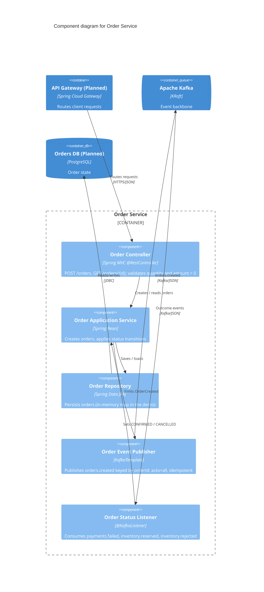

# Level 3: Components, Order Service

```mermaid
C4Component
    title Component diagram for Order Service

    Container(gw, "API Gateway (Planned)", "Spring Cloud Gateway", "Routes client requests")
    ContainerQueue(kafka, "Apache Kafka", "KRaft", "Event backbone")
    ContainerDb(db, "Orders DB (Planned)", "PostgreSQL", "Order state")

    Container_Boundary(order, "Order Service") {
        Component(ctrl, "Order Controller", "Spring MVC @RestController", "POST /orders, GET /orders/{id}; validates quantity and amount > 0")
        Component(app, "Order Application Service", "Spring Bean", "Creates orders, applies status transitions")
        Component(repo, "Order Repository", "Spring Data JPA", "Persists orders (in-memory map in the demo)")
        Component(pub, "Order Event Publisher", "KafkaTemplate", "Publishes orders.created keyed by orderId; acks=all, idempotent")
        Component(lis, "Order Status Listener", "@KafkaListener", "Consumes payments.failed, inventory.reserved, inventory.rejected")
    }

    Rel(gw, ctrl, "Routes requests", "HTTPS/JSON")
    Rel(ctrl, app, "Creates / reads orders")
    Rel(app, repo, "Saves / loads")
    Rel(app, pub, "Emits OrderCreated")
    Rel(pub, kafka, "orders.created", "Kafka/JSON")
    Rel(kafka, lis, "Outcome events", "Kafka/JSON")
    Rel(lis, app, "Sets CONFIRMED / CANCELLED")
    Rel(repo, db, "Reads/writes", "JDBC")

    UpdateLayoutConfig($c4ShapeInRow="3", $c4BoundaryInRow="1")
```
