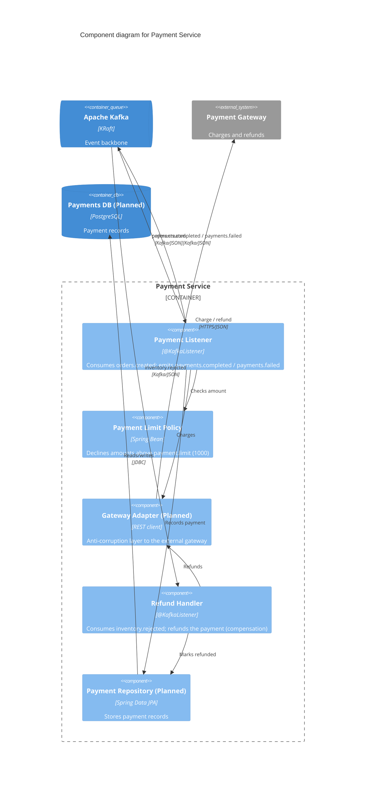

# Level 3: Components, Payment Service

```mermaid
C4Component
    title Component diagram for Payment Service

    ContainerQueue(kafka, "Apache Kafka", "KRaft", "Event backbone")
    System_Ext(pay, "Payment Gateway", "Charges and refunds")
    ContainerDb(db, "Payments DB (Planned)", "PostgreSQL", "Payment records")

    Container_Boundary(payment, "Payment Service") {
        Component(lis, "Payment Listener", "@KafkaListener", "Consumes orders.created; emits payments.completed / payments.failed")
        Component(policy, "Payment Limit Policy", "Spring Bean", "Declines amounts above payment.limit (1000)")
        Component(adapter, "Gateway Adapter (Planned)", "REST client", "Anti-corruption layer to the external gateway")
        Component(refund, "Refund Handler", "@KafkaListener", "Consumes inventory.rejected; refunds the payment (compensation)")
        Component(repo, "Payment Repository (Planned)", "Spring Data JPA", "Stores payment records")
    }

    Rel(kafka, lis, "orders.created", "Kafka/JSON")
    Rel(lis, policy, "Checks amount")
    Rel(lis, adapter, "Charges")
    Rel(lis, repo, "Records payment")
    Rel(lis, kafka, "payments.completed / payments.failed", "Kafka/JSON")
    Rel(kafka, refund, "inventory.rejected", "Kafka/JSON")
    Rel(refund, adapter, "Refunds")
    Rel(refund, repo, "Marks refunded")
    Rel(adapter, pay, "Charge / refund", "HTTPS/JSON")
    Rel(repo, db, "Reads/writes", "JDBC")

    UpdateLayoutConfig($c4ShapeInRow="3", $c4BoundaryInRow="1")
```
