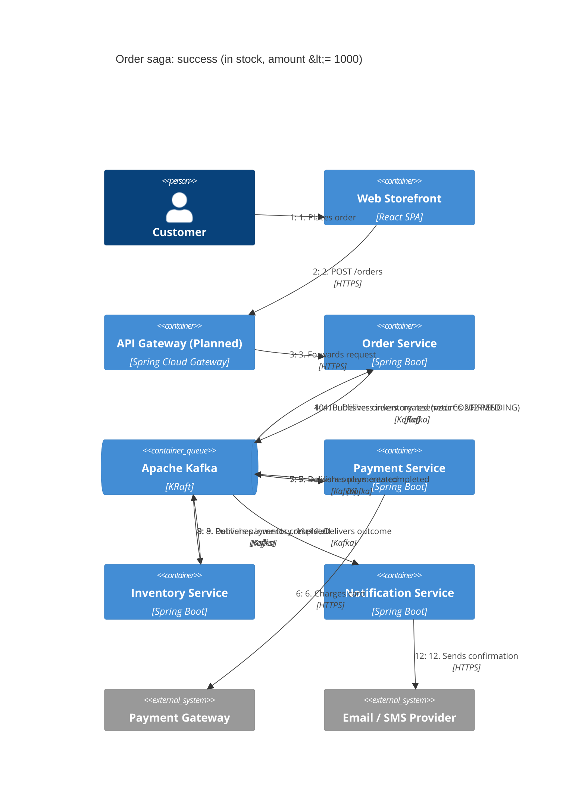
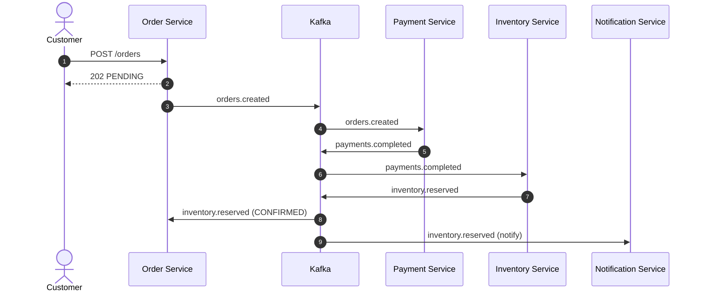

# Dynamic: Order saga, happy path

Choreography saga: no orchestrator; each service reacts to events. The POST returns `202 PENDING` immediately; the order becomes `CONFIRMED` asynchronously.

```mermaid
C4Dynamic
    title Order saga: success (in stock, amount <= 1000)

    Person(customer, "Customer", "")
    Container(spa, "Web Storefront", "React SPA", "")
    Container(gw, "API Gateway (Planned)", "Spring Cloud Gateway", "")
    Container(order, "Order Service", "Spring Boot", "")
    ContainerQueue(kafka, "Apache Kafka", "KRaft", "")
    Container(payment, "Payment Service", "Spring Boot", "")
    Container(inventory, "Inventory Service", "Spring Boot", "")
    Container(notification, "Notification Service", "Spring Boot", "")
    System_Ext(pgw, "Payment Gateway", "")
    System_Ext(notify, "Email / SMS Provider", "")

    Rel(customer, spa, "1. Places order")
    Rel(spa, gw, "2. POST /orders", "HTTPS")
    Rel(gw, order, "3. Forwards request", "HTTPS")
    Rel(order, kafka, "4. Publishes orders.created (returns 202 PENDING)", "Kafka")
    Rel(kafka, payment, "5. Delivers orders.created", "Kafka")
    Rel(payment, pgw, "6. Charges card", "HTTPS")
    Rel(payment, kafka, "7. Publishes payments.completed", "Kafka")
    Rel(kafka, inventory, "8. Delivers payments.completed", "Kafka")
    Rel(inventory, kafka, "9. Publishes inventory.reserved", "Kafka")
    Rel(kafka, order, "10. Delivers inventory.reserved: CONFIRMED", "Kafka")
    Rel(kafka, notification, "11. Delivers outcome", "Kafka")
    Rel(notification, notify, "12. Sends confirmation", "HTTPS")

    UpdateLayoutConfig($c4ShapeInRow="4", $c4BoundaryInRow="1")
```

```mermaid
sequenceDiagram
    autonumber
    actor C as Customer
    participant O as Order Service
    participant K as Kafka
    participant P as Payment Service
    participant I as Inventory Service
    participant N as Notification Service
    C->>O: POST /orders
    O-->>C: 202 PENDING
    O->>K: orders.created
    K->>P: orders.created
    P->>K: payments.completed
    K->>I: payments.completed
    I->>K: inventory.reserved
    K->>O: inventory.reserved (CONFIRMED)
    K->>N: inventory.reserved (notify)
```
