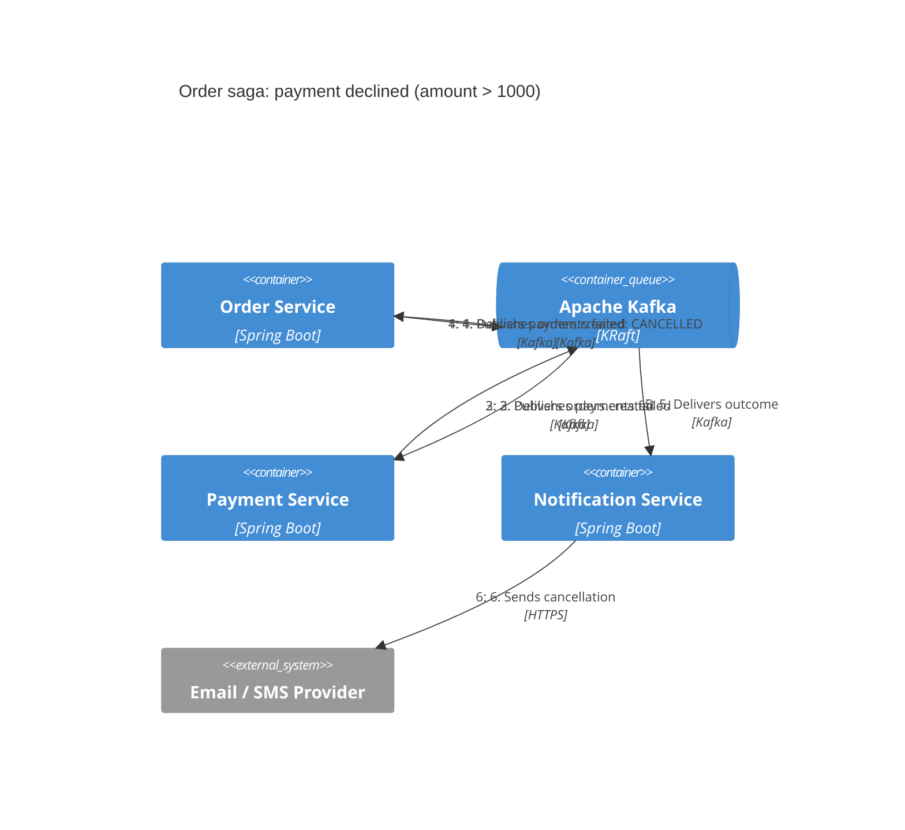
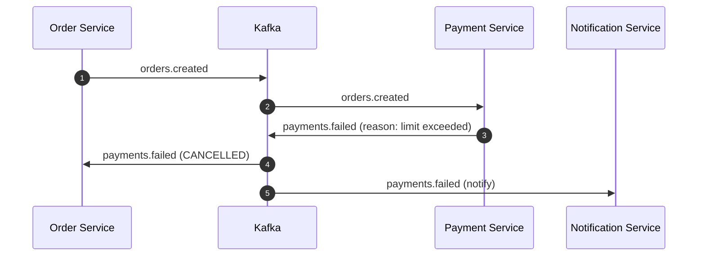

# Dynamic: Payment failure

Amounts above `payment.limit` (1000) are declined; no stock is touched, so nothing needs compensating.

```mermaid
C4Dynamic
    title Order saga: payment declined (amount > 1000)

    Container(order, "Order Service", "Spring Boot", "")
    ContainerQueue(kafka, "Apache Kafka", "KRaft", "")
    Container(payment, "Payment Service", "Spring Boot", "")
    Container(notification, "Notification Service", "Spring Boot", "")
    System_Ext(notify, "Email / SMS Provider", "")

    Rel(order, kafka, "1. Publishes orders.created", "Kafka")
    Rel(kafka, payment, "2. Delivers orders.created", "Kafka")
    Rel(payment, kafka, "3. Publishes payments.failed", "Kafka")
    Rel(kafka, order, "4. Delivers payments.failed: CANCELLED", "Kafka")
    Rel(kafka, notification, "5. Delivers outcome", "Kafka")
    Rel(notification, notify, "6. Sends cancellation", "HTTPS")

    UpdateLayoutConfig($c4ShapeInRow="3", $c4BoundaryInRow="1")
```

```mermaid
sequenceDiagram
    autonumber
    participant O as Order Service
    participant K as Kafka
    participant P as Payment Service
    participant N as Notification Service
    O->>K: orders.created
    K->>P: orders.created
    P->>K: payments.failed (reason: limit exceeded)
    K->>O: payments.failed (CANCELLED)
    K->>N: payments.failed (notify)
```
