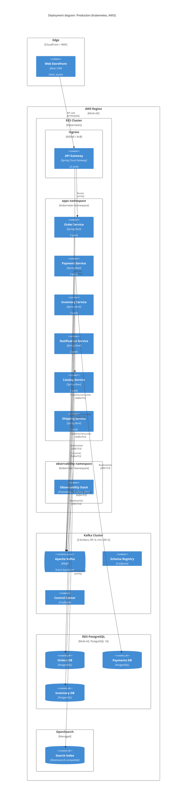

# Deployment: Production (target state)

```mermaid
C4Deployment
    title Deployment diagram: Production (Kubernetes, AWS)

    Deployment_Node(edge, "Edge", "CloudFront + WAF") {
        Container(spa, "Web Storefront", "React SPA", "Static assets")
    }

    Deployment_Node(region, "AWS Region", "Multi-AZ") {
        Deployment_Node(eks, "EKS Cluster", "Kubernetes") {
            Deployment_Node(ing, "Ingress", "NGINX / ALB") {
                Container(gw, "API Gateway", "Spring Cloud Gateway", "x2 pods")
            }
            Deployment_Node(apps, "apps namespace", "Kubernetes Namespace") {
                Container(order, "Order Service", "Spring Boot", "3 pods")
                Container(payment, "Payment Service", "Spring Boot", "3 pods")
                Container(inventory, "Inventory Service", "Spring Boot", "3 pods")
                Container(notification, "Notification Service", "Spring Boot", "2 pods")
                Container(catalog, "Catalog Service", "Spring Boot", "2 pods")
                Container(shipping, "Shipping Service", "Spring Boot", "2 pods")
            }
            Deployment_Node(obsns, "observability namespace", "Kubernetes Namespace") {
                Container(obs, "Observability Stack", "Prometheus, Grafana, OTel", "")
            }
        }
        Deployment_Node(kc, "Kafka Cluster", "3 brokers, RF=3, min ISR=2") {
            ContainerQueue(kafka, "Apache Kafka", "KRaft", "Event backbone")
            Container(registry, "Schema Registry", "Confluent", "")
            Container(cc, "Control Center", "Confluent", "")
        }
        Deployment_Node(rds, "RDS PostgreSQL", "Multi-AZ, PostgreSQL 16") {
            ContainerDb(odb, "Orders DB", "PostgreSQL", "")
            ContainerDb(pdb, "Payments DB", "PostgreSQL", "")
            ContainerDb(idb, "Inventory DB", "PostgreSQL", "")
        }
        Deployment_Node(os, "OpenSearch", "Managed") {
            ContainerDb(search, "Search Index", "Elasticsearch-compatible", "")
        }
    }

    Rel(spa, gw, "API calls", "HTTPS/JSON")
    Rel(gw, order, "Routes", "HTTPS")
    Rel(gw, catalog, "Routes", "HTTPS")
    Rel(order, kafka, "Publishes/consumes", "Kafka/TLS")
    Rel(payment, kafka, "Publishes/consumes", "Kafka/TLS")
    Rel(inventory, kafka, "Publishes/consumes", "Kafka/TLS")
    Rel(notification, kafka, "Consumes", "Kafka/TLS")
    Rel(shipping, kafka, "Publishes/consumes", "Kafka/TLS")
    Rel(order, odb, "Reads/writes", "JDBC/TLS")
    Rel(payment, pdb, "Reads/writes", "JDBC/TLS")
    Rel(inventory, idb, "Reads/writes", "JDBC/TLS")
    Rel(catalog, search, "Indexes/queries", "HTTPS")

    UpdateLayoutConfig($c4ShapeInRow="3", $c4BoundaryInRow="1")
```
