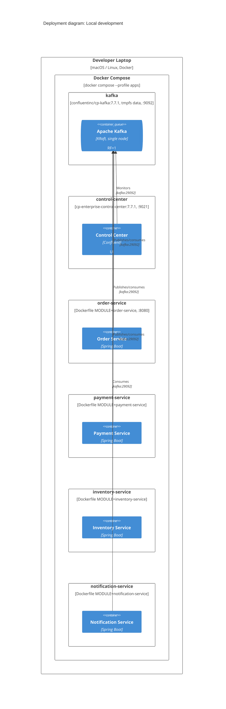

# Deployment: Local (docker compose)

Matches the demo's `docker-compose.yml`: `docker compose up -d` starts Kafka and Control Center; `--profile apps` also builds and starts the four services.

```mermaid
C4Deployment
    title Deployment diagram: Local development

    Deployment_Node(laptop, "Developer Laptop", "macOS / Linux, Docker") {
        Deployment_Node(compose, "Docker Compose", "docker compose --profile apps") {
            Deployment_Node(kn, "kafka", "confluentinc/cp-kafka:7.7.1, tmpfs data, :9092") {
                ContainerQueue(kafka, "Apache Kafka", "KRaft, single node", "RF=1")
            }
            Deployment_Node(ccn, "control-center", "cp-enterprise-control-center:7.7.1, :9021") {
                Container(cc, "Control Center", "Confluent", "UI")
            }
            Deployment_Node(on, "order-service", "Dockerfile MODULE=order-service, :8080") {
                Container(order, "Order Service", "Spring Boot", "")
            }
            Deployment_Node(pn, "payment-service", "Dockerfile MODULE=payment-service") {
                Container(payment, "Payment Service", "Spring Boot", "")
            }
            Deployment_Node(inn, "inventory-service", "Dockerfile MODULE=inventory-service") {
                Container(inventory, "Inventory Service", "Spring Boot", "")
            }
            Deployment_Node(nn, "notification-service", "Dockerfile MODULE=notification-service") {
                Container(notification, "Notification Service", "Spring Boot", "")
            }
        }
    }

    Rel(order, kafka, "Publishes/consumes", "kafka:29092")
    Rel(payment, kafka, "Publishes/consumes", "kafka:29092")
    Rel(inventory, kafka, "Publishes/consumes", "kafka:29092")
    Rel(notification, kafka, "Consumes", "kafka:29092")
    Rel(cc, kafka, "Monitors", "kafka:29092")

    UpdateLayoutConfig($c4ShapeInRow="3", $c4BoundaryInRow="1")
```
