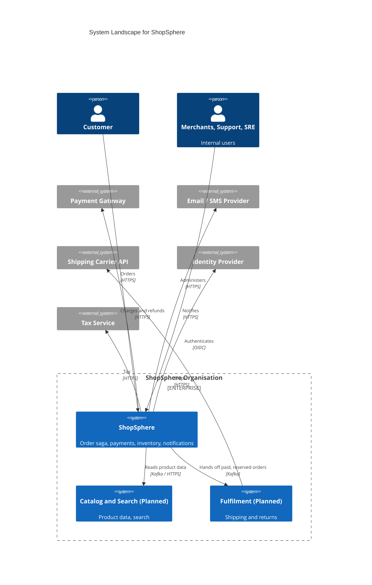

# System Landscape

ShopSphere alongside the external systems it integrates with, grouped by enterprise boundary.

```mermaid
C4Context
    title System Landscape for ShopSphere

    Person(customer, "Customer", "")
    Person(staff, "Merchants, Support, SRE", "Internal users")

    Enterprise_Boundary(ent, "ShopSphere Organisation") {
        System(shop, "ShopSphere", "Order saga, payments, inventory, notifications")
        System(catalogsys, "Catalog and Search (Planned)", "Product data, search")
        System(shipsys, "Fulfilment (Planned)", "Shipping and returns")
    }

    System_Ext(pay, "Payment Gateway", "")
    System_Ext(notify, "Email / SMS Provider", "")
    System_Ext(carrier, "Shipping Carrier API", "")
    System_Ext(idp, "Identity Provider", "")
    System_Ext(tax, "Tax Service", "")

    Rel(customer, shop, "Orders", "HTTPS")
    Rel(staff, shop, "Administers", "HTTPS")
    Rel(shop, catalogsys, "Reads product data", "Kafka / HTTPS")
    Rel(shop, shipsys, "Hands off paid, reserved orders", "Kafka")
    Rel(shop, pay, "Charges and refunds", "HTTPS")
    Rel(shop, notify, "Notifies", "HTTPS")
    Rel(shipsys, carrier, "Ships", "HTTPS")
    Rel(shop, idp, "Authenticates", "OIDC")
    Rel(shop, tax, "Tax", "HTTPS")

    UpdateLayoutConfig($c4ShapeInRow="3", $c4BoundaryInRow="1")
```
